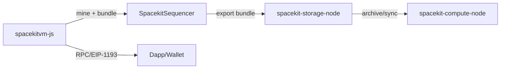

# SpaceKit‑JS — Quantum‑Safe Browser & IoT Blockchain VM

A quantum‑safe, browser‑native blockchain VM and TypeScript SDK for running SpaceKit WASM smart contracts on browsers, IoT devices, and servers.

SpaceKit‑JS replaces EVM bytecode with WASM and adds built‑in modules for AI, storage, compute, networking, messaging, and decentralized content sharing.

This provides the import modules expected by the contracts under `contracts/`:
- `env`
- `spacekit_storage`
- `sk_erc20`
- `sk_erc721`
- `spacekit_reputation`
- `spacekit_fact`
- `spacekit_llm`

## What is spacekit-js?
`spacekit-js` is a browser-native VM and host SDK for Spacekit WASM smart contracts.
It runs the same contracts in a browser or compute node, exposes JSON-RPC and EIP-1193
for dapp compatibility, supports rollup bundling + Merkle proofs, and persists state
locally (IndexedDB) or via `spacekit-storage-node` and connects to other `spacekit-compute-node` instances.
It also integrates the Post-Quantum Quantum Verkle WASM module to compute state roots and proofs directly from VM storage.

### Contents
- [What is spacekit-js?](#what-is-spacekit-js)
- [Production readiness](#production-readiness)
- [Developer docs](#developer-docs)
- [How it compares](#how-it-compares)
- [Use cases](#use-cases)
- [Installation](#installation)
- [Quick usage](#quick-usage)
- [WASM assets](#wasm-assets)
- [Notes](#notes)
- [Spacekit-JS Browser VM](#spacekit-js-browser-vm)
- [Quantum Verkle](#quantum-verkle-state-root--proofs)
- [Sequencer mode](#sequencer-mode-rollup-bundles)
- [JSON-RPC extensions](#json-rpc-extensions)
- [JSON-RPC HTTP server](#json-rpc-http-server)
- [IndexedDB autosync + snapshots](#indexeddb-autosync--snapshots)
- [Rollup export](#rollup-export-to-spacekit-storage-node)
- [Browser extension (MV3)](#browser-extension-mv3-skeleton)
- [Glossary](#glossary)

### Production readiness
Core functionality is production-ready (WASM execution, JSON-RPC, browser demo, rollup bundling,
proofs, and storage sync). Optional components can be enabled as needed:
- **Extension wallet + EIP-1193**: ready for dapp flows; permissions and listing metadata
  should be finalized before store release.
- **PQ signing (SPHINCS+)**: optional path; requires building the WASM module and configuring keys.
- **Remote storage sync**: available via `spacekit-storage-node`, with LWW merge by default.

### Developer docs
Start here: `docs/index.md` (setup, ABI details, VM APIs, RPC/EIP-1193, storage sync, security).

### Ecosystem components
SpacekitVM-JS integrates with:
- `spacekit-compute-node`: network execution and rollup validation
- `spacekit-storage-node`: archival storage and sync backends

### Security considerations
- **Browser storage**: use strong passphrases; avoid untrusted environments.
- **LWW conflicts**: last-write-wins can overwrite divergent updates; prefer sync discipline.
- **Wallet security**: treat extension keys as production secrets; rotate as needed.
- **Audits**: wallet and signing flows should be independently reviewed before store release.

### How it compares
- **vs EVM clients**: EVM is bytecode-only and server-first; Spacekit uses WASM with
  a deterministic host ABI and can run fully in-browser.
- **vs CosmWasm**: both use WASM smart contracts; `spacekitvm-js` adds an in-browser
  chain + JSON-RPC + extension bridge out of the box.
- **vs NEAR**: NEAR’s Wasm runtime is network-first; Spacekit adds a local browser VM
  with rollup export and storage-node sync.
- **vs Polkadot/ink!**: ink! contracts run in a Substrate node; Spacekit focuses on
  browser-native execution with the same host ABI as `spacekit-compute-node`.
- **vs Solana/SVM**: Solana is a high-perf runtime but not browser-native; Spacekit
  emphasizes local browser chains with rollup export and storage-node sync.
- **vs Move (Aptos/Sui)**: Move is a dedicated VM; Spacekit uses WASM for portability
  and browser-first execution.
- **vs zkVMs**: zkVMs focus on validity proofs; Spacekit focuses on Merkle proofs
  and rollup bundles today, with zk layers possible later.
- **vs PQ-focused chains**: Spacekit can enable PQ signing (SPHINCS+) for bundles/txs,
  while keeping standard Ed25519 for compatibility; PQ is optional and policy-driven.

#### Comparison table (quick scan)
| Feature | SpacekitVM-JS | EVM clients | CosmWasm |
| --- | --- | --- | --- |
| Browser-native VM | ✅ | ❌ | ❌ |
| WASM contracts | ✅ | ❌ | ✅ |
| JSON-RPC + EIP-1193 | ✅ | ✅ | ❌ |
| Rollup bundling | ✅ | Optional | Optional |
| PQ signing (optional) | ✅ | ❌ | ❌ |

### Use cases
- **Browser devnet**: fast local chain for dapp prototyping without running a full node.
- **Offline demos**: run contracts and state in a browser/PWA with cached assets.
- **Rollup client**: mine blocks, produce bundles, and export to `spacekit-storage-node`.
- **Edge verification**: verify Merkle proofs and receipts client-side for light clients.
- **Extension wallet**: EIP-1193 provider + signing for browser dapp flows.
- **Cross-network bridging**: connect to `spacekit-compute-node` instances for testnet/mainnet parity.

## Installation

### From GitHub
```bash
npm install @spacekit/spacekit-js@github:spacekit-xyz/spacekit-js
```

### From source
```bash
git clone https://github.com/spacekit-xyz/spacekit-js.git
cd spacekit-js
npm install
npm run build
```

### Peer dependencies

SpacekitJS expects React to be installed in the host app:
```bash
npm install react react-dom
```

## Quick usage

```ts
import { createHost, instantiateWasm, callSpacekitMain } from "@spacekit/spacekit-js";

const host = createHost({
  callerDid: "did:spacekit:browser:demo",
});

const wasmBytes = await fetch("/contracts/artifacts/app_store_contract.wasm");
const { instance } = await instantiateWasm(wasmBytes, host.imports);
host.bindInstance(instance);

const input = new Uint8Array([1, 0, 0]); // contract-specific
const { result, status } = callSpacekitMain(host.context, instance, input);
console.log(status, result);
```

### Contract clients (opt-in)

Contract clients are available via the `@spacekit/spacekit-js/contracts` subpath to
avoid bloating the core VM:

```ts
import { SkErc20Client, SkErc721Client } from "@spacekit/spacekit-js/contracts";
```

## WASM assets

WASM modules (Kyber, SPHINCS+, Quantum Verkle) are built into `dist/wasm/` by the
build scripts in `scripts/`. Pre-built artifacts are included in the repo.

To rebuild WASM from source:
```bash
npm run build:quantum-verkle-wasm   # Quantum Verkle
npm run pq:wasm                     # SPHINCS+ (requires wasi-sdk)
```

WASM assets can be served from any public path. Override locations when
initializing the VM (see Quantum Verkle section below).

### Prerequisites
- Node.js 18+
- Modern browser with WASM + IndexedDB support

### Build + typecheck
```bash
npm run build
npm run typecheck
```

## Notes

- Some contracts use inconsistent `storage_read` signatures (with and without output pointer). The host supports both, but a 2-arg call can only return the stored length, not bytes.
- Compression and LLM calls are stubbed by default; inject adapters in `createHost` to wire real implementations.
- The in-memory storage/token/NFT/reputation adapters are intentionally simple and meant for browser compute-node prototyping.
- `StorageNodeAdapter` uses the storage-node `/api/documents` endpoints with DID auth. It is a cache-first adapter with async `pull/push` helpers.
- `IndexedDbStorageAdapter` provides browser persistence (cache-first). Call `init()` once and `syncAll()` to persist.
- Contract artifacts are expected under `contracts/artifacts/*.wasm` when running the demo from the repo root.
- The example `Uint8Array([1, 0, 0])` is contract-specific; see `src/examples/` for usage patterns.

## Spacekit-JS Browser VM

```ts
import { SpacekitVm } from "@spacekit/spacekit-js";

const vm = new SpacekitVm({ maxBlocksInMemory: 100 });
const contract = await vm.deployContract(fetch("/contracts/sk_erc20_contract.wasm"), "sk-erc20");

await vm.submitTransaction("sk-erc20", new Uint8Array([4]), "did:spacekit:demo:alice"); // total_supply
const block = await vm.mineBlock();
console.log(block?.blockHash);
```

## Quantum Verkle (state root + proofs)
SpacekitVM can compute Quantum Verkle state roots and proofs using the
`spacekit-quantum-verkle` WASM module. In the browser, point the loader at public assets:

```ts
import { SpacekitVm } from "@spacekit/spacekit-js";

const vm = new SpacekitVm({
  quantumVerkle: {
    enabled: true,
    moduleUrl: "/wasm/quantum_verkle_wasm.js",
    wasmUrl: "/wasm/quantum_verkle_wasm_bg.wasm",
  },
});

await vm.initQuantumVerkle();
const root = await vm.computeQuantumStateRoot();
const proof = await vm.getQuantumStateProof("0x...");
console.log(root, proof);
```

Stateless sync: mined block headers now include `quantumStateRoot`, so clients can
verify `vm_quantumStateProof` responses against an authenticated header.

### Auto miner (timer)
```ts
const stop = vm.startAutoMiner({ intervalMs: 2000, onlyIfPending: true });
// later: stop();
```

### Block sealing + pruning
When `maxBlocksInMemory` is reached, blocks are sealed into a single hash and pruned from memory.
You can use `getSealedArchives()` to retain those hashes and run rolling chains in-browser.

## Sequencer mode (rollup bundles)

```ts
import { SpacekitSequencer } from "@spacekit/spacekit-js";
const sequencer = new SpacekitSequencer(vm, { maxBlocksPerBundle: 10 });
await sequencer.mineAndBundle();
const bundle = await sequencer.flushBundle();
console.log(bundle.bundleHash);
```

### Bundle signing + export
```ts
import { SpacekitSequencer } from "@spacekit/spacekit-js";

const sequencer = new SpacekitSequencer(vm);
const bundle = await sequencer.flushBundle();
const signed = await sequencer.signBundle(bundle, { privateKeyHex: "<hex-32-bytes>" });
await sequencer.exportSignedBundle(signed, storageNode);
```

## JSON-RPC extensions
- `vm_tx` / `vm_receipt` for lookup by `txId`
- `vm_stateProof` for key-based proof (stateRoot + proofHash)
- `vm_quantumStateRoot`, `vm_quantumStateProof` for Quantum Verkle roots/proofs
- `vm_deployBatch` / `vm_submitBatch` for batch deploy/tx flows
- `vm_getNonce`, `vm_submitSigned`, `vm_submitSignedBatch` for signed tx flows
- `vm_txProof`, `vm_receiptProof` for Merkle inclusion proofs
- `vm_hostAbi` for ABI version + import modules
- `vm_feePolicy`, `vm_feeEstimate`, `vm_gasPolicy`, `vm_gasEstimate`
- `vm_verifyProof` for Merkle proof verification

### Treasury handling
`SpacekitVm` can be initialized with `treasuryDid` to collect fees:
```ts
const vm = new SpacekitVm({ treasuryDid: "did:spacekit:treasury" });
```

### Light-client proofs
SpacekitVM exposes Merkle proofs for tx/receipt/state:
- `vm_txProof`, `vm_receiptProof`, `vm_stateProof` (browser VM)
- compute-node JSON-RPC `/rpc`: `spacekit_txProof`, `spacekit_receiptProof`, `spacekit_stateProof`

Client-side verification helpers:
- `verifyComputeNodeTxProof`, `verifyComputeNodeReceiptProof`, `verifyComputeNodeStateProof`
- `verifyMerkleProofFromHash` for pre-hashed leaves

### Quantum-safe hooks (SPHINCS+)
SpacekitVM supports optional PQ verification hooks for signed txs:
```ts
const vm = new SpacekitVm({
  requirePqSignature: true,
  pqVerifier: async (messageHex, signatureBase64, publicKeyHex, algorithm) => {
    // plug in a SPHINCS+ verifier (WASM or remote)
    return false;
  },
});
```

Proof harness example (run from repo source):
```bash
SPACEKIT_RPC_URL=http://127.0.0.1:8747/rpc \
  node src/examples/proof_harness.js <txHash> [addressHex] [storageKeyHex]
```

## Extension provider bridge (EIP-1193)
The MV3 extension now injects `window.ethereum` with `request`, backed by the
local RPC handler. Supported today:
- `eth_requestAccounts`, `eth_accounts`
- `personal_sign` (requires wallet unlock)
- `eth_signTypedData_v4` (requires wallet unlock)

Unlock the wallet from the extension UI (10-minute session). The signature is
Ed25519-derived and returned as hex (not ECDSA).

## JSON-RPC HTTP server

```ts
import { startJsonRpcServer } from "@spacekit/spacekit-js";
startJsonRpcServer(vm, { port: 8747, allowlist: ["127.0.0.1"], apiKey: "dev-key" });
```

Supports JSON-RPC batching (array of requests) and CORS preflight.
Rate limiting is enabled by default (120 req/min per IP); override via `rateLimit` option.

## IndexedDB autosync + snapshots

```ts
import { VmAutoSync, IndexedDbStorageAdapter } from "@spacekit/spacekit-js";

const storage = new IndexedDbStorageAdapter("spacekitvm", "kv");
const autosync = new VmAutoSync(vm, { storage });
await autosync.initFromSnapshot();
autosync.start();
```

### Conflict-resolving sync (LWW)
`IndexedDbStorageAdapter` stores a per-key `version` (timestamp). Use:
- `entriesWithVersion()` / `setWithVersion()` for versioned replication
- `mergeFromRemote(entries, "lww")` for last-write-wins merge

### Remote sync (storage-node)
```ts
import { syncWithStorageNode, StorageNodeAdapter } from "@spacekit/spacekit-js";

const remote = new StorageNodeAdapter({
  baseUrl: "http://localhost:3030",
  did: "did:spacekit:demo:sync",
});

await syncWithStorageNode(storage, remote);
```

## Rollup export to spacekit-storage-node

```ts
import { StorageNodeAdapter, SpacekitSequencer } from "@spacekit/spacekit-js";

const storageNode = new StorageNodeAdapter({
  baseUrl: "http://localhost:3030",
  did: "did:spacekit:demo:sequencer",
});

const sequencer = new SpacekitSequencer(vm);
const bundle = await sequencer.flushBundle();
await sequencer.exportBundle(bundle, storageNode);
```

## Rollup key policy (compute-node)
The compute-node validator can enforce key expiry + revocation using a JSON policy file.
Set `SPACEKIT_ROLLUP_KEY_POLICY_PATH` (default: `temp_blockchain_storage/rollup_key_policy.json`).

## Rollup API auth (compute-node)
Set one of:
- `SPACEKIT_ROLLUP_API_KEY` (exact match)
- `SPACEKIT_ROLLUP_JWT_SECRET` (HS256 verification)
- `SPACEKIT_ROLLUP_JWT` (exact token match, legacy)

## Browser extension (MV3) skeleton

Files in `extension/` (development only, not included in dist):
- `manifest.json`
- `background.js` (forwards JSON-RPC to local server)
- `content-script.js` + `injected-provider.js` (window.spacekitvm bridge)

Usage:
1. Build/run the JSON-RPC server at `http://127.0.0.1:8747`
2. Load the extension folder in Chrome (Extensions → Load unpacked)
3. Open the extension settings page to configure RPC URL + API key

Packaging notes:
- Default host permissions allow `http://127.0.0.1/*` and `http://localhost/*`.
- Use optional host permissions for remote RPC endpoints.
- `injected-provider.js` is declared in `web_accessible_resources` for MV3 compliance.

### Wallet integration
The extension popup (`wallet.html`) can generate a local Ed25519 key, expose the public key,
and sign messages for `vm_submitSigned`. Keys are stored in extension local storage.
Wallet uses passphrase-based encryption (PBKDF2 + AES-GCM).
PQ key storage/rotation hooks are available for SPHINCS+ keys (base64 import + rotate).
The extension auto-attaches PQ signature fields to `vm_submitSigned` if PQ keys exist.
SPHINCS+ signing is provided via WASM (`dist/wasm/sphincs_wasm.js` + `.wasm`).

Build SPHINCS+ WASM:
```bash
npm run pq:wasm
```
Requires `wasi-sdk` for the C toolchain headers used by `pqcrypto-internals`.
Install with `brew install wasi-sdk` or set `WASI_SDK_PATH` to a custom install.

### Policy tooling
```bash
npm run policy:generate
npm run policy:rotate
npm run policy:revoke
```

## Keypair tooling (ed25519)

```bash
npm run keys:generate
npm run keys:rotate
```

## Ecosystem flow (diagram)


## Glossary
- **DID**: Decentralized Identifier used for callers and identities.
- **Rollup bundle**: A batch of blocks sealed together for export/validation.
- **Merkle proof**: Inclusion proof for tx/receipt/state roots.
- **EIP-1193**: Ethereum provider interface (`window.ethereum`).
- **LWW**: Last-write-wins merge strategy for sync conflicts.
