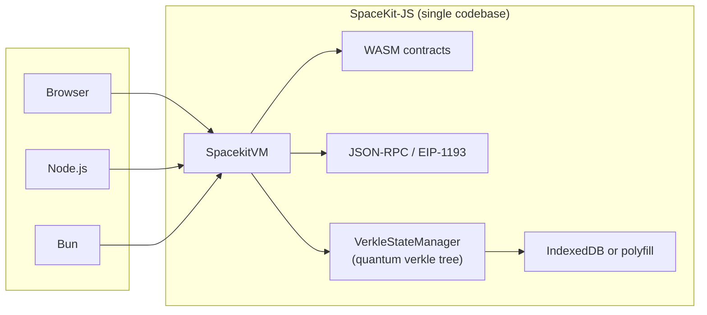
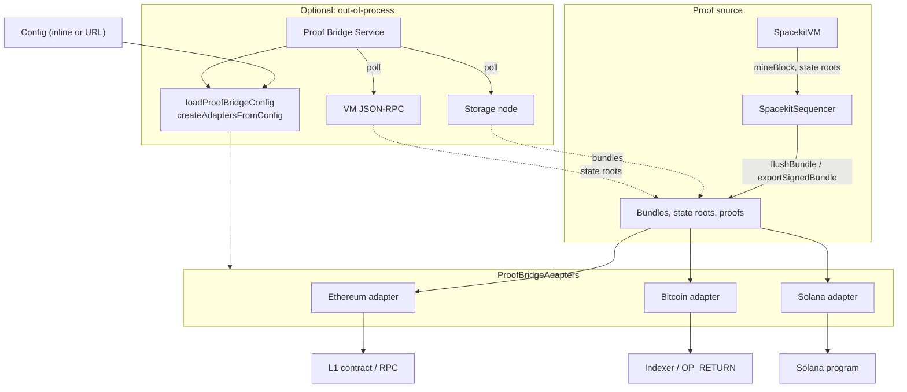
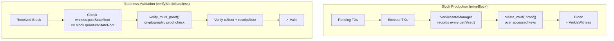
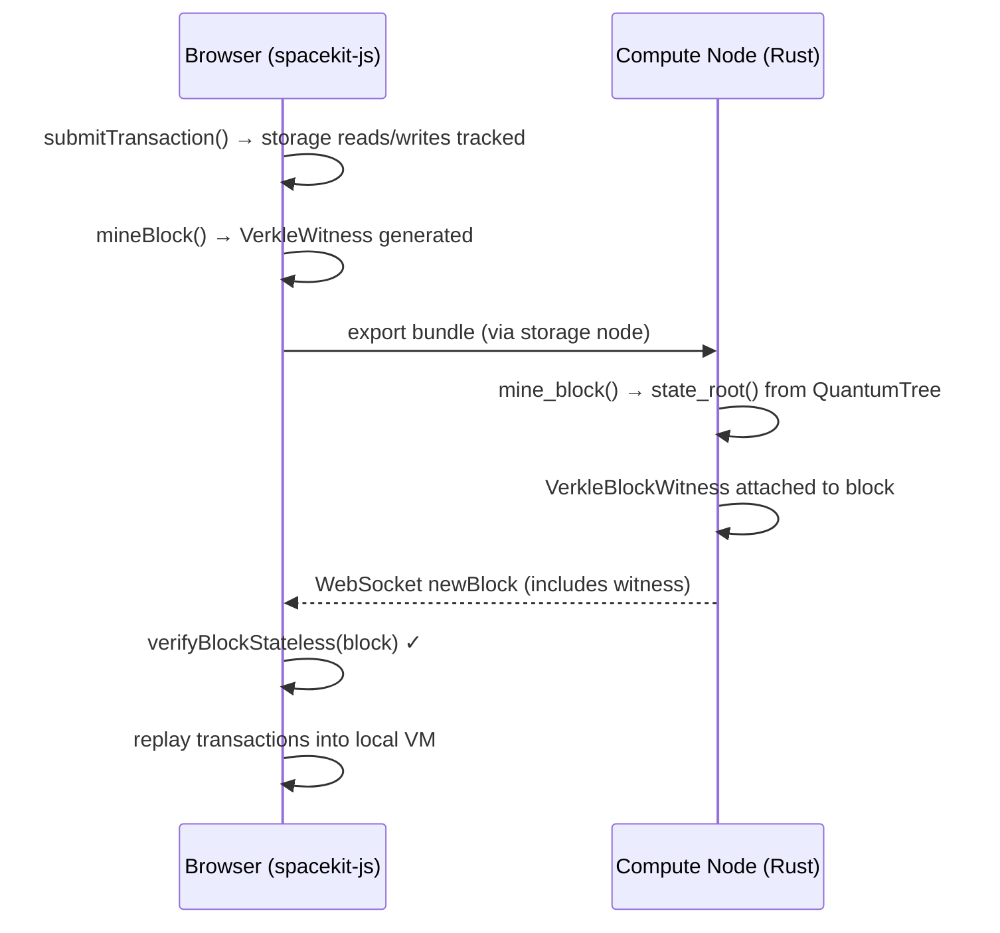

# SpaceKit‑JS — Quantum‑Safe Multi‑Runtime Blockchain VM

A quantum‑safe, multi‑runtime blockchain VM and TypeScript SDK for running SpaceKit WASM smart contracts on **browsers**, **Node.js**, and **Bun**.

SpaceKit‑JS replaces EVM bytecode with WASM and adds built‑in modules for AI, storage, compute, networking, messaging, and decentralized content sharing.

This provides the import modules expected by the contracts under `contracts/`:
- `env`
- `spacekit_storage`
- `sk_erc20`
- `sk_erc721`
- `spacekit_reputation`
- `spacekit_fact`
- `spacekit_llm`

## What is spacekit-js?
`spacekit-js` is a multi‑runtime VM and host SDK for Spacekit WASM smart contracts.
It runs the same contracts in a browser, Node.js, or Bun, exposes JSON-RPC and EIP-1193
for dapp compatibility, supports rollup bundling + Merkle proofs, and persists state
locally (IndexedDB or polyfilled equivalent) or via `spacekit-storage-node` and connects
to other `spacekit-compute-node` instances.
It integrates the Post-Quantum Quantum Verkle WASM module for stateless block
validation — every mined block includes a verkle witness (multi-proof over accessed
keys) so that light clients can verify state transitions without holding full state.

### Contents
- [What is spacekit-js?](#what-is-spacekit-js)
- [Multi-runtime support](#multi-runtime-support)
- [Architecture diagrams](#architecture-diagrams)
- [Production readiness](#production-readiness)
- [Developer docs](#developer-docs)
- [How it compares](#how-it-compares)
- [Use cases](#use-cases)
- [Installation](#installation)
- [Quick usage](#quick-usage)
- [Running on Node.js](#running-on-nodejs)
- [Running on Bun](#running-on-bun)
- [WASM assets](#wasm-assets)
- [Notes](#notes)
- [Spacekit-JS VM](#spacekit-js-vm)
- [Quantum Verkle](#quantum-verkle-state-root--proofs)
- [Stateless Architecture](#stateless-architecture)
- [Sequencer mode](#sequencer-mode-rollup-bundles)
- [JSON-RPC extensions](#json-rpc-extensions)
- [JSON-RPC HTTP server](#json-rpc-http-server)
- [IndexedDB autosync + snapshots](#indexeddb-autosync--snapshots)
- [Rollup export](#rollup-export-to-spacekit-storage-node)
- [Network decimals (VM chain presets)](#network-decimals-vm-chain-presets)
- [Proof bridge (other chains)](#proof-bridge-other-chains)
- [Browser extension (MV3)](#browser-extension-mv3-skeleton)
- [Kit Protocol integration (kit.space)](#kit-protocol-integration-kitspace)
- [Glossary](#glossary)

### Multi-runtime support

SpaceKit‑JS runs on three deployment targets from the same codebase:

| Runtime | Status | Entry point | IndexedDB |
| --- | --- | --- | --- |
| **Browser** | Stable | `import` from `@spacekit/spacekit-js` | Native |
| **Node.js** (>=18) | Stable | `node dist/entry-node.js` | In-memory or persistent (see below) |
| **Bun** | Stable | `bun dist/entry-bun.js` | In-memory or persistent (see below) |

All three targets share the same TypeScript source, WASM contracts, and JSON-RPC interface.
Server runtimes (Node.js / Bun) use an IndexedDB implementation so that
`IndexedDbStorageAdapter`, `IndexedDbBlockStore`, `SessionStore`, and all other
IndexedDB-backed classes work without modification.

**IndexedDB on Node.js / Bun (two options):**

- **Default**: In-memory polyfill (`fake-indexeddb`). No persistence across restarts; no extra config.
- **Persistent (pure TypeScript)**: Set `SPACEKIT_IDB_BACKEND=wal` before calling `installPolyfills()`. Optional `SPACEKIT_IDB_PATH=/path/to/dir` (default: `.spacekit-idb`). Data is stored as a WAL file and replayed on startup; no SQLite or native addons.

#### Platform detection

```ts
import { detectRuntime, installPolyfills } from "@spacekit/spacekit-js";

const runtime = detectRuntime(); // "browser" | "node" | "bun"

// Call once before using IndexedDB-backed storage on server runtimes
await installPolyfills();
```

#### npm scripts

| Script | Description |
| --- | --- |
| `npm run deploy:browser` | Build for browser (existing behavior) |
| `npm run deploy:node` | Build for Node.js deployment |
| `npm run deploy:bun` | Build for Bun deployment |
| `npm run start:node` | Build + start Node.js JSON-RPC server |
| `npm run start:node:dev` | Same, with dev mode (no signature checks) |
| `npm run start:bun` | Build + start Bun JSON-RPC server |
| `npm run start:bun:dev` | Same, with dev mode |
| `npm run start:bun:native` | Uses `Bun.serve()` for best performance |

### Architecture diagrams

**Multi-runtime VM (Browser / Node.js / Bun)**



**Proof bridge architecture**



### Production readiness
Core functionality is production-ready (WASM execution, JSON-RPC, browser demo, rollup bundling,
proofs, storage sync, and stateless block validation). Optional components can be enabled as needed:
- **Stateless validation**: enabled by default when `quantumVerkle.enabled` is true; blocks include verkle witnesses for light-client verification.
- **Extension wallet + EIP-1193**: ready for dapp flows; permissions and listing metadata
  should be finalized before store release.
- **PQ signing (SPHINCS+)**: optional path; requires building the WASM module and configuring keys.
- **Remote storage sync**: available via `spacekit-storage-node`, with LWW merge by default.

### Developer docs
Start here: `docs/index.md` (setup, ABI details, VM APIs, RPC/EIP-1193, storage sync, security).

### Ecosystem components
SpacekitVM-JS integrates with:
- `spacekit-compute-node`: network execution and rollup validation
- `spacekit-storage-node`: archival storage and sync backends

### Security considerations
- **Browser storage**: use strong passphrases; avoid untrusted environments.
- **LWW conflicts**: last-write-wins can overwrite divergent updates; prefer sync discipline.
- **Wallet security**: treat extension keys as production secrets; rotate as needed.
- **Audits**: wallet and signing flows should be independently reviewed before store release.

### How it compares
- **vs EVM clients**: EVM is bytecode-only and server-first; Spacekit uses WASM with
  a deterministic host ABI and runs in browsers, Node.js, and Bun.
- **vs CosmWasm**: both use WASM smart contracts; `spacekitvm-js` adds an in-browser
  chain + JSON-RPC + extension bridge out of the box.
- **vs NEAR**: NEAR’s Wasm runtime is network-first; Spacekit adds a local browser VM
  with rollup export and storage-node sync.
- **vs Polkadot/ink!**: ink! contracts run in a Substrate node; Spacekit focuses on
  browser-native execution with the same host ABI as `spacekit-compute-node`.
- **vs Solana/SVM**: Solana is a high-perf runtime but not browser-native; Spacekit
  emphasizes local browser chains with rollup export and storage-node sync.
- **vs Move (Aptos/Sui)**: Move is a dedicated VM; Spacekit uses WASM for portability
  and browser-first execution.
- **vs zkVMs**: zkVMs focus on validity proofs; Spacekit uses quantum-resistant verkle
  witnesses for stateless block validation, with zk layers possible later.
- **vs PQ-focused chains**: Spacekit can enable PQ signing (SPHINCS+) for bundles/txs,
  while keeping standard Ed25519 for compatibility; PQ is optional and policy-driven.

#### Comparison table (quick scan)
| Feature | SpacekitVM-JS | EVM clients | CosmWasm |
| --- | --- | --- | --- |
| Multi-runtime (browser/Node/Bun) | ✅ | ❌ | ❌ |
| WASM contracts | ✅ | ❌ | ✅ |
| JSON-RPC + EIP-1193 | ✅ | ✅ | ❌ |
| Rollup bundling | ✅ | Optional | Optional |
| PQ signing (optional) | ✅ | ❌ | ❌ |
| Stateless block validation | ✅ (verkle witness) | ❌ | ❌ |

### Use cases
- **Browser devnet**: fast local chain for dapp prototyping without running a full node.
- **Offline demos**: run contracts and state in a browser/PWA with cached assets.
- **Node.js server**: run the VM + JSON-RPC server headlessly for backend services and CI.
- **Bun server**: high-performance server-side execution with `Bun.serve()` or `node:http`.
- **Rollup client**: mine blocks, produce bundles, and export to `spacekit-storage-node`.
- **Edge verification**: verify Merkle proofs and receipts client-side for light clients.
- **Stateless light clients**: validate blocks using only the block header + verkle witness, without downloading full state.
- **Extension wallet**: EIP-1193 provider + signing for browser dapp flows.
- **Cross-network bridging**: connect to `spacekit-compute-node` instances for testnet/mainnet parity.

## Installation

### From GitHub
```bash
npm install @spacekit/spacekit-js@github:spacekit-xyz/spacekit-js
```

### From source
```bash
git clone https://github.com/spacekit-xyz/spacekit-js.git
cd spacekit-js
npm install
npm run build
```

### Peer dependencies

SpacekitJS expects React to be installed in the host app (browser builds):
```bash
npm install react react-dom
```

### Server runtime dependencies

- **Default (in-memory IndexedDB)**: `fake-indexeddb` is an optional dependency and is installed automatically. To install explicitly: `npm install fake-indexeddb`.
- **Persistent IndexedDB (WAL)**: No extra dependency. Set `SPACEKIT_IDB_BACKEND=wal` (and optionally `SPACEKIT_IDB_PATH`) before `installPolyfills()` to use the built-in pure TypeScript WAL backend; data persists under the chosen path.

## Quick usage

```ts
import { createHost, instantiateWasm, callSpacekitMain } from "@spacekit/spacekit-js";

const host = createHost({
  callerDid: "did:spacekit:browser:demo",
});

const wasmBytes = await fetch("/contracts/artifacts/app_store_contract.wasm");
const { instance } = await instantiateWasm(wasmBytes, host.imports);
host.bindInstance(instance);

const input = new Uint8Array([1, 0, 0]); // contract-specific
const { result, status } = callSpacekitMain(host.context, instance, input);
console.log(status, result);
```

### Contract clients (opt-in)

Contract clients are available via the `@spacekit/spacekit-js/contracts` subpath to
avoid bloating the core VM:

```ts
import { SkErc20Client, SkErc721Client } from "@spacekit/spacekit-js/contracts";
```

## Running on Node.js

Start the JSON-RPC server with a single command:

```bash
npm run start:node
```

Or run the entry point directly with options:

```bash
node dist/entry-node.js --port 8747 --host 127.0.0.1 --chain-id spacekit-local --dev-mode true
```

Environment variables are also supported:

```bash
SPACEKIT_PORT=8747 \
SPACEKIT_HOST=0.0.0.0 \
SPACEKIT_CHAIN_ID=spacekit-mainnet \
SPACEKIT_API_KEY=my-secret-key \
  node dist/entry-node.js
```

When used as a library in your own Node.js application, call `installPolyfills()`
before using any IndexedDB-backed storage:

```ts
import { installPolyfills, SpacekitVm, createInMemoryStorage } from "@spacekit/spacekit-js";

await installPolyfills();

const vm = new SpacekitVm({
  storage: createInMemoryStorage(),
  chainId: "my-chain",
  devMode: true,
});
```

To persist VM state, blocks, and session across restarts, use the WAL IndexedDB backend (pure TypeScript, no SQLite):

```bash
SPACEKIT_IDB_BACKEND=wal SPACEKIT_IDB_PATH=./data node dist/entry-node.js
```

Or set the env vars in code before `installPolyfills()`.

## Running on Bun

Start the JSON-RPC server with Bun:

```bash
npm run start:bun
```

Or run directly:

```bash
bun dist/entry-bun.js --port 8747 --dev-mode true
```

For maximum performance, use Bun's native HTTP server (`Bun.serve()`) instead
of the Node.js-compatible `node:http` server:

```bash
bun dist/entry-bun.js --use-bun-serve true
# or
npm run start:bun:native
```

The same environment variables as Node.js are supported, plus:
- `SPACEKIT_USE_BUN_SERVE=true` to enable `Bun.serve()` mode

## WASM assets

WASM modules (Kyber, SPHINCS+, Quantum Verkle) are built into `dist/wasm/` by the
build scripts in `scripts/`. Pre-built artifacts are included in the repo.

To rebuild WASM from source:
```bash
npm run build:quantum-verkle-wasm   # Quantum Verkle
npm run pq:wasm                     # SPHINCS+ (requires wasi-sdk)
```

WASM assets can be served from any public path. Override locations when
initializing the VM (see Quantum Verkle section below).

### Prerequisites
- **Browser**: Modern browser with WASM + IndexedDB support
- **Node.js**: v18+ (WASM, `fetch`, and ES modules required)
- **Bun**: v1.0+ (WASM and ES modules required)

### Build + typecheck
```bash
npm run build
npm run typecheck
```

## Notes

- Some contracts use inconsistent `storage_read` signatures (with and without output pointer). The host supports both, but a 2-arg call can only return the stored length, not bytes.
- Compression and LLM calls are stubbed by default; inject adapters in `createHost` to wire real implementations.
- The in-memory storage/token/NFT/reputation adapters are intentionally simple and meant for browser compute-node prototyping.
- `StorageNodeAdapter` uses the storage-node `/api/documents` endpoints with DID auth. It is a cache-first adapter with async `pull/push` helpers.
- `IndexedDbStorageAdapter` provides browser persistence (cache-first). Call `init()` once and `syncAll()` to persist.
- Contract artifacts are expected under `contracts/artifacts/*.wasm` when running the demo from the repo root.
- The example `Uint8Array([1, 0, 0])` is contract-specific; see `src/examples/` for usage patterns.

## Spacekit-JS VM

```ts
import { SpacekitVm } from "@spacekit/spacekit-js";

const vm = new SpacekitVm({ maxBlocksInMemory: 100 });
const contract = await vm.deployContract(fetch("/contracts/sk_erc20_contract.wasm"), "sk-erc20");

await vm.submitTransaction("sk-erc20", new Uint8Array([4]), "did:spacekit:demo:alice"); // total_supply
const block = await vm.mineBlock();
console.log(block?.blockHash);
```

## Quantum Verkle (state root + proofs)
SpacekitVM can compute Quantum Verkle state roots and proofs using the
`spacekit-quantum-verkle` WASM module. In the browser, point the loader at public assets:

```ts
import { SpacekitVm } from "@spacekit/spacekit-js";

const vm = new SpacekitVm({
  quantumVerkle: {
    enabled: true,
    moduleUrl: "/wasm/quantum_verkle_wasm.js",
    wasmUrl: "/wasm/quantum_verkle_wasm_bg.wasm",
  },
});

await vm.initQuantumVerkle();
const root = await vm.computeQuantumStateRoot();
const proof = await vm.getQuantumStateProof("0x...");
console.log(root, proof);
```

Mined block headers include `quantumStateRoot`, so clients can verify
`vm_quantumStateProof` responses against an authenticated header.

## Stateless Architecture

SpaceKit uses a **stateless blockchain** design where validators and light clients can
verify blocks using only the block header, transactions, and a **verkle witness** — no
full state database required.

### How it works



### Components

| Component | Location | Role |
| --- | --- | --- |
| `VerkleStateManager` | `spacekit-js/src/vm/verkle_state.ts` | Wraps `StorageAdapter` with a live `QuantumVerkleWasm` tree; records access logs; generates witnesses |
| `VerkleWitness` (Block) | `spacekit-js/src/vm/spacekitvm.ts` | Witness data attached to every mined block: `proofHex`, `accessedKeys[]`, `preStateRoot`, `postStateRoot` |
| `verifyBlockStateless()` | `SpacekitVm` | Verifies a block using only its header + witness, no full state |
| `QuantumTree<NistSisScheme>` | `spacekit-compute-node/swtchvm_node.rs` | Native Rust verkle tree maintained alongside the flat state `HashMap`; updated incrementally on every `set_storage()` |
| `VerkleBlockWitness` | `spacekit-compute-node/swtchvm_node.rs` | Witness struct serialized into `SwtchvmBlock` for over-the-wire blocks |

### VerkleStateManager (spacekit-js)

When `quantumVerkle.enabled` is true (the default), `SpacekitVm` wraps its storage in
a `VerkleStateManager` that:

1. Maintains a **persistent** `QuantumVerkleWasm` tree — updated incrementally on each `set()`, avoiding full-rescan.
2. Records every `get()` and `set()` as an `AccessRecord` with key, value, and mode (read/write).
3. At `mineBlock()` time, flushes the access log and generates a `VerkleWitness` via `create_multi_proof()`.
4. Attaches the witness to `Block.witness`.

```ts
import { VerkleStateManager, createInMemoryStorage } from "@spacekit/spacekit-js";

const inner = createInMemoryStorage();
const verkle = new VerkleStateManager(inner, {
  moduleUrl: "/wasm/quantum_verkle_wasm.js",
  wasmUrl: "/wasm/quantum_verkle_wasm_bg.wasm",
});
await verkle.init();

verkle.set(key, value);                    // updates tree + records access
const root = await verkle.flushRoot();     // current verkle root (no re-scan)
const { log, preRoot } = verkle.flushAccessLog();
const witness = await verkle.generateWitness(log, preRoot);
```

### Stateless block verification

```ts
const block = receivedFromWebSocketOrRPC();
const result = await vm.verifyBlockStateless(block);
if (!result.valid) {
  console.error("Block rejected:", result.reason);
}
```

The method checks:
1. `witness.postStateRoot` matches `block.quantumStateRoot`
2. `verify_multi_proof()` succeeds for all accessed keys
3. `txRoot` and `receiptRoot` match the block's transactions and receipts

### Compute node integration

The Rust compute node (`spacekit-compute-node`) mirrors the same architecture natively:

- `SwtchvmState` holds a live `QuantumTree<NistSisScheme>` alongside its `HashMap<(Address, Key), Value>` storage.
- Every `set_storage()` call updates the tree incrementally.
- `state_root()` returns the **verkle root** by default. The legacy merkle root is still available via `merkle_state_root()`.
- Blocks include a `VerkleBlockWitness` with pre/post state roots.
- After deserialization (e.g. loading from disk), `rebuild_verkle_tree()` repopulates the tree from the flat store.

### Data flow (browser ↔ compute node)



### Auto miner (timer)
```ts
const stop = vm.startAutoMiner({ intervalMs: 2000, onlyIfPending: true });
// later: stop();
```

### Block sealing + pruning
When `maxBlocksInMemory` is reached, blocks are sealed into a single hash and pruned from memory.
You can use `getSealedArchives()` to retain those hashes and run rolling chains in-browser.

## Sequencer mode (rollup bundles)

```ts
import { SpacekitSequencer } from "@spacekit/spacekit-js";
const sequencer = new SpacekitSequencer(vm, { maxBlocksPerBundle: 10 });
await sequencer.mineAndBundle();
const bundle = await sequencer.flushBundle();
console.log(bundle.bundleHash);
```

### Bundle signing + export
```ts
import { SpacekitSequencer } from "@spacekit/spacekit-js";

const sequencer = new SpacekitSequencer(vm);
const bundle = await sequencer.flushBundle();
const signed = await sequencer.signBundle(bundle, { privateKeyHex: "<hex-32-bytes>" });
await sequencer.exportSignedBundle(signed, storageNode);
```

## JSON-RPC extensions
- `vm_tx` / `vm_receipt` for lookup by `txId`
- `vm_stateProof` for key-based proof (stateRoot + proofHash)
- `vm_quantumStateRoot`, `vm_quantumStateProof` for Quantum Verkle roots/proofs
- `vm_deployBatch` / `vm_submitBatch` for batch deploy/tx flows
- `vm_getNonce`, `vm_submitSigned`, `vm_submitSignedBatch` for signed tx flows
- `vm_txProof`, `vm_receiptProof` for Merkle inclusion proofs
- `vm_hostAbi` for ABI version + import modules
- `vm_feePolicy`, `vm_feeEstimate`, `vm_gasPolicy`, `vm_gasEstimate`
- `vm_verifyProof` for Merkle proof verification

### Treasury handling
`SpacekitVm` can be initialized with `treasuryDid` to collect fees:
```ts
const vm = new SpacekitVm({ treasuryDid: "did:spacekit:treasury" });
```

### Light-client proofs
SpacekitVM exposes Merkle proofs for tx/receipt/state:
- `vm_txProof`, `vm_receiptProof`, `vm_stateProof` (browser VM)
- compute-node JSON-RPC `/rpc`: `spacekit_txProof`, `spacekit_receiptProof`, `spacekit_stateProof`

Client-side verification helpers:
- `verifyComputeNodeTxProof`, `verifyComputeNodeReceiptProof`, `verifyComputeNodeStateProof`
- `verifyMerkleProofFromHash` for pre-hashed leaves

### Quantum-safe hooks (SPHINCS+)
SpacekitVM supports optional PQ verification hooks for signed txs:
```ts
const vm = new SpacekitVm({
  requirePqSignature: true,
  pqVerifier: async (messageHex, signatureBase64, publicKeyHex, algorithm) => {
    // plug in a SPHINCS+ verifier (WASM or remote)
    return false;
  },
});
```

Proof harness example (run from repo source):
```bash
SPACEKIT_RPC_URL=http://127.0.0.1:8747/rpc \
  node src/examples/proof_harness.js <txHash> [addressHex] [storageKeyHex]
```

## Extension provider bridge (EIP-1193)
The MV3 extension now injects `window.ethereum` with `request`, backed by the
local RPC handler. Supported today:
- `eth_requestAccounts`, `eth_accounts`
- `personal_sign` (requires wallet unlock)
- `eth_signTypedData_v4` (requires wallet unlock)

Unlock the wallet from the extension UI (10-minute session). The signature is
Ed25519-derived and returned as hex (not ECDSA).

## JSON-RPC HTTP server

The JSON-RPC server works on all runtimes. On Node.js and Bun, the entry point
scripts start it automatically. You can also start it programmatically:

```ts
import { startJsonRpcServer } from "@spacekit/spacekit-js";
startJsonRpcServer(vm, { port: 8747, allowlist: ["127.0.0.1"], apiKey: "dev-key" });
```

Supports JSON-RPC batching (array of requests) and CORS preflight.
Rate limiting is enabled by default (120 req/min per IP); override via `rateLimit` option.

On Bun, an alternative native server is available via the `--use-bun-serve` flag
for better throughput (see [Running on Bun](#running-on-bun)).

## IndexedDB autosync + snapshots

```ts
import { VmAutoSync, IndexedDbStorageAdapter } from "@spacekit/spacekit-js";

const storage = new IndexedDbStorageAdapter("spacekitvm", "kv");
const autosync = new VmAutoSync(vm, { storage });
await autosync.initFromSnapshot();
autosync.start();
```

### Conflict-resolving sync (LWW)
`IndexedDbStorageAdapter` stores a per-key `version` (timestamp). Use:
- `entriesWithVersion()` / `setWithVersion()` for versioned replication
- `mergeFromRemote(entries, "lww")` for last-write-wins merge

### Remote sync (storage-node)
```ts
import { syncWithStorageNode, StorageNodeAdapter } from "@spacekit/spacekit-js";

const remote = new StorageNodeAdapter({
  baseUrl: "http://localhost:3030",
  did: "did:spacekit:demo:sync",
});

await syncWithStorageNode(storage, remote);
```

## Rollup export to spacekit-storage-node

```ts
import { StorageNodeAdapter, SpacekitSequencer } from "@spacekit/spacekit-js";

const storageNode = new StorageNodeAdapter({
  baseUrl: "http://localhost:3030",
  did: "did:spacekit:demo:sequencer",
});

const sequencer = new SpacekitSequencer(vm);
const bundle = await sequencer.flushBundle();
await sequencer.exportBundle(bundle, storageNode);
```

### Network decimals (VM chain presets)

When the VM is used for a specific network (e.g. browser-VM “programmed for” BTC, ETH, SOL, ASTRA), **decimal places and symbol** are set via **genesis config** in `src/vm/genesis.ts`. Use `getGenesisPresetForNetwork(chainId)` or `NETWORK_DECIMAL_PRESETS` to get a `GenesisConfig` that matches each chain: **Bitcoin 8**, **Ethereum 18**, **Solana 9**, **ASTRA 18**. Pass it as `genesisConfig` when creating the VM. The Node/Bun entry points apply this automatically when `SPACEKIT_CHAIN_ID` is `bitcoin`, `ethereum`, `solana`, `astra`, or `spacekit-local`. This is independent of and compatible with the proof bridge (same target chains).

### Proof bridge (other chains)

The VM and sequencer can push state roots, bundles, and proofs to **external chains** (Ethereum, Bitcoin, Solana) via pluggable adapters. You pass `proofBridgeAdapters` into `SpacekitSequencer`; on each `flushBundle()` and `exportSignedBundle()` the sequencer submits the payload to each ready adapter. Config can be loaded from a URL (e.g. network config) or inline via `loadProofBridgeConfig` and `createAdaptersFromConfig`; import `@spacekit/spacekit-js/adapters` to register the built-in Ethereum, Bitcoin, and Solana adapters. Optional out-of-process daemon: set `PROOF_BRIDGE_CONFIG_URL` or `PROOF_BRIDGE_CONFIG_PATH`, `PROOF_BRIDGE_SOURCE=storage|rpc`, and storage/RPC env vars, then run `npm run proof-bridge-service`. See **[docs/PROOF_BRIDGE_DESIGN.md](docs/PROOF_BRIDGE_DESIGN.md)** for the adapter interface, config shape, and per-chain notes. **[docs/examples/PROOF_BRIDGE_EXAMPLES.md](docs/examples/PROOF_BRIDGE_EXAMPLES.md)** has example config JSON, env file, and code. Types: `ProofBridgeAdapter`, `ProofBridgePayload`, `ProofBridgeConfig`.

## Rollup key policy (compute-node)
The compute-node validator can enforce key expiry + revocation using a JSON policy file.
Set `SPACEKIT_ROLLUP_KEY_POLICY_PATH` (default: `temp_blockchain_storage/rollup_key_policy.json`).

## Rollup API auth (compute-node)
Set one of:
- `SPACEKIT_ROLLUP_API_KEY` (exact match)
- `SPACEKIT_ROLLUP_JWT_SECRET` (HS256 verification)
- `SPACEKIT_ROLLUP_JWT` (exact token match, legacy)

## Browser extension (MV3) skeleton

Files in `extension/` (development only, not included in dist):
- `manifest.json`
- `background.js` (forwards JSON-RPC to local server)
- `content-script.js` + `injected-provider.js` (window.spacekitvm bridge)

Usage:
1. Build/run the JSON-RPC server at `http://127.0.0.1:8747`
2. Load the extension folder in Chrome (Extensions → Load unpacked)
3. Open the extension settings page to configure RPC URL + API key

Packaging notes:
- Default host permissions allow `http://127.0.0.1/*` and `http://localhost/*`.
- Use optional host permissions for remote RPC endpoints.
- `injected-provider.js` is declared in `web_accessible_resources` for MV3 compliance.

### Wallet integration
The extension popup (`wallet.html`) can generate a local Ed25519 key, expose the public key,
and sign messages for `vm_submitSigned`. Keys are stored in extension local storage.
Wallet uses passphrase-based encryption (PBKDF2 + AES-GCM).
PQ key storage/rotation hooks are available for SPHINCS+ keys (base64 import + rotate).
The extension auto-attaches PQ signature fields to `vm_submitSigned` if PQ keys exist.
SPHINCS+ signing is provided via WASM (`dist/wasm/sphincs_wasm.js` + `.wasm`).

Build SPHINCS+ WASM:
```bash
npm run pq:wasm
```
Requires `wasi-sdk` for the C toolchain headers used by `pqcrypto-internals`.
Install with `brew install wasi-sdk` or set `WASI_SDK_PATH` to a custom install.

### Policy tooling
```bash
npm run policy:generate
npm run policy:rotate
npm run policy:revoke
```

## Keypair tooling (ed25519)

```bash
npm run keys:generate
npm run keys:rotate
```

## Kit Protocol integration (kit.space)

`kit-protocol` is a WASM smart contract that acts as the on-chain backend for
[kit.space](https://kit.space). It is deployed into the browser SpacekitVM via
`spacekit-js` and uses the standard host ABI (`env`, `spacekit_storage`, events).

### Architecture

```mermaid
flowchart TB
  subgraph Browser["Browser (kit.space-website)"]
    UI["React UI\nKitFeed / PostSignal / Guilds"]
    SDK["protocol/ SDK\nEncode · Decode · useKitProtocol"]
    VM["SpacekitVm (spacekit-js)"]
    VSM["VerkleStateManager\naccess tracking + witness gen"]
    WASM["kit_protocol.wasm\nregistry · feed · reputation · marketplace"]
    IDB["IndexedDB\nblock store + session"]
  end

  subgraph Network
    SN["spacekit-storage-node\n:3030 P2P + API"]
    CN["spacekit-compute-node\n:8747 JSON-RPC + WS\nQuantumTree verkle state"]
  end

  UI --> SDK
  SDK -->|submitTransaction / executeQuery| VM
  VM --> VSM
  VSM --> WASM
  VSM --> IDB
  VM -->|WebSocket + HeaderSyncClient| CN
  VM -->|verifyBlockStateless()| VM
  VM -->|SpacekitSequencer.exportBundle| SN
  SN <-->|P2P sync| CN
```

### Contract modules

| Module | Opcodes | Purpose |
| --- | --- | --- |
| **registry** | `0x01`–`0x0F` | DID identity registration, guild CRUD, membership |
| **feed** | `0x10`–`0x1F` | Posts (text/image/video/audio), category + guild + author indexes |
| **reputation** | `0x20`–`0x2F` | Reactions (fire/heart/eyes), signal scores, author scores |
| **marketplace** | `0x30`–`0x3F` | NFT listings, content-locked access, buy/delist |

### Deployment

```ts
import { SpacekitVm } from "@spacekit/spacekit-js";

const vm = new SpacekitVm({ storage, devMode: true });
const wasm = await fetch("/wasm/kit_protocol.wasm");
const contract = await vm.deployContract(
  new Uint8Array(await wasm.arrayBuffer()),
  "kit-protocol",
);
```

### Submitting a transaction (example: create post)

```ts
import { Writer } from "kit.space-website/src/protocol/codec";

const input = new Writer()
  .u8(0x10)                    // OP_CREATE_POST
  .string(callerDid)           // author DID
  .u8(0)                       // POST_TYPE_TEXT
  .u8(0)                       // FEED_PUBLIC
  .string("tech")              // category
  .string("")                  // guild ID (empty = no guild)
  .string("My first post")    // title
  .string("storage:abc123")   // content_ref (CID from storage node)
  .u64(BigInt(Date.now()))     // created_at
  .u8(2)                       // tag count
  .string("spacekit")
  .string("wasm")
  .finish();

const tx = await vm.submitTransaction(contract.id, input, callerDid);
const block = await vm.mineBlock();
// receipt.result contains the new post ID as u64 LE bytes
```

### Querying (no mining)

```ts
const query = new Writer().u8(0x12).u8(0xff).u32(0).u8(20).finish(); // LIST_POSTS
const receipt = await vm.executeTransaction(contract.id, query, callerDid, 0n);
// Decode receipt.result with the protocol Reader
```

### Storage node integration

Post bodies, images, and media are stored off-chain via `spacekit-storage-node`
(running at `localhost:3030`). The contract stores a `content_ref` (hash/CID)
that the client resolves:

```ts
// Push content to storage node
const res = await fetch("http://localhost:3030/api/v1/store", {
  method: "POST",
  headers: { "Content-Type": "application/octet-stream" },
  body: postBody,
});
const { key } = await res.json();

// Store `key` as content_ref in the contract
// Later: resolve content
const content = await fetch(`http://localhost:3030/api/v1/fetch/${key}`);
```

### Compute node sync

Browser VMs sync with the canonical chain via `HeaderSyncClient`:

```ts
import { HeaderSyncClient } from "@spacekit/spacekit-js";

const sync = new HeaderSyncClient({
  rpcUrl: "http://localhost:8747/rpc",
});

const { headers, latestHeight } = await sync.syncHeaders(localHeight + 1);
```

Rollup bundles from the browser sequencer are exported to the storage node,
which the compute node picks up for validation and inclusion in the canonical chain.

### Integration status

| Layer | Status | Details |
| --- | --- | --- |
| Rust contract (4 modules) | **Done** | Compiles to 136 KB WASM; registry, feed, reputation, marketplace |
| TypeScript codec + ops | **Done** | `protocol/codec.ts`, `protocol/ops.ts` mirror Rust binary format |
| `useKitProtocol` hook | **Done** | Deploys WASM, exposes typed methods; reuses existing deployment |
| `useKitFeed` hook | **Done** | Auto-deploys, seeds mock data, resolves content from storage node |
| Compute VM header sync | **Done** | `HeaderSyncClient` polls `:8747/rpc` every 10s; full block replay |
| WebSocket real-time sync | **Done** | `ws://localhost:8747/ws` for instant block propagation; exponential backoff reconnects |
| Sequencer bundle export | **Done** | `onBundle` exports bundles to storage node via `StorageNodeAdapter` |
| Content resolution | **Done** | `useKitFeed.refresh()` resolves `content_ref` from storage node |
| DID wallet identity | **Done** | `useDidWallet` generates Ed25519 keypair; `upgradeToQuantum()` for SLH-DSA |
| Transaction signing | **Done** | `submitAndMine` signs via `TxSignerFn`; supports Ed25519 + SLH-DSA |
| PostSignal composer | **Done** | Pushes body to storage node, calls `kit.createPost()` + `kit.listNft()` |
| Guild operations | **Done** | CREATE / JOIN / LEAVE in `GuildsPage` |
| NFT purchase flow | **Done** | `kit.buyNft()` with ASTRA value transfer |
| Persistent verkle tree (JS) | **Done** | `VerkleStateManager` wraps storage with live `QuantumVerkleWasm`; incremental `set()` |
| Storage access tracking | **Done** | Every `get()`/`set()` records `AccessRecord` with key, value, mode |
| Verkle witnesses in blocks | **Done** | `mineBlock()` generates `VerkleWitness` via `create_multi_proof()`; attached to `Block.witness` |
| Stateless block validation (JS) | **Done** | `vm.verifyBlockStateless(block)` — header + witness only, no full state |
| Compute node verkle tree (Rust) | **Done** | `QuantumTree<NistSisScheme>` in `SwtchvmState`; `state_root()` returns verkle root |
| Compute node witness | **Done** | `VerkleBlockWitness` included in `SwtchvmBlock` with pre/post state roots |
| Stateless verification on replay | **Done** | `replayRemoteBlock()` verifies witness before applying remote blocks |

### Future enhancements

| Task | Component | Description |
| --- | --- | --- |
| **Multi-node discovery** | `SpacekitVmContext` | Auto-discover compute nodes via mDNS or seed list instead of hardcoded localhost |
| **Offline queue** | `SpacekitVmContext` | Queue transactions when offline and flush when reconnected |
| **Per-tx access tracking (compute node)** | `spacekit-compute-node` | Track per-transaction storage reads/writes during execution to generate fine-grained multi-proofs with `create_multi_proof()` |

## Ecosystem flow (diagram)
```mermaid
flowchart LR
  BrowserVM["Browser (spacekit-js)\nVerkleStateManager"] -->|mine + bundle\n+ VerkleWitness| Sequencer[SpacekitSequencer]
  NodeVM["Node.js (spacekit-js)\nVerkleStateManager"] -->|mine + bundle| Sequencer
  BunVM["Bun (spacekit-js)\nVerkleStateManager"] -->|mine + bundle| Sequencer
  Sequencer -->|export bundle| StorageNode[spacekit-storage-node]
  StorageNode -->|archive/sync| ComputeNode["spacekit-compute-node\nQuantumTree (Rust)"]
  ComputeNode -->|blocks + witness\n(WS / RPC)| BrowserVM
  BrowserVM -->|verifyBlockStateless()| BrowserVM
  BrowserVM -->|RPC/EIP-1193| Dapp[Dapp/Wallet]
  NodeVM -->|JSON-RPC HTTP| Dapp
  BunVM -->|JSON-RPC HTTP| Dapp
```

## Glossary
- **DID**: Decentralized Identifier used for callers and identities.
- **Rollup bundle**: A batch of blocks sealed together for export/validation.
- **Merkle proof**: Inclusion proof for tx/receipt/state roots.
- **Verkle tree**: Quantum-resistant commitment tree (`spacekit-quantum-verkle`) used for stateless state proofs; replaces the legacy merkle tree for `quantumStateRoot`.
- **Verkle witness**: A `VerkleWitness` containing a multi-proof, accessed keys, and pre/post state roots — included in blocks to enable stateless validation.
- **Stateless validation**: Verifying a block using only the block header, transactions, and verkle witness — without holding the full state database.
- **`VerkleStateManager`**: Wrapper around `StorageAdapter` that keeps a live `QuantumVerkleWasm` tree in sync and tracks key access for witness generation.
- **EIP-1193**: Ethereum provider interface (`window.ethereum`).
- **LWW**: Last-write-wins merge strategy for sync conflicts.
- **Multi-runtime**: Ability to run the same codebase on browser, Node.js, and Bun.
- **`fake-indexeddb`**: In-memory IndexedDB polyfill for server runtimes (default when not using WAL).
- **WAL backend**: Built-in pure TypeScript IndexedDB implementation (append-only log + sorted store) for persistent storage on Node/Bun; enable with `SPACEKIT_IDB_BACKEND=wal`.
- **`installPolyfills()`**: One-time setup call that installs the chosen IndexedDB implementation for server runtimes.
